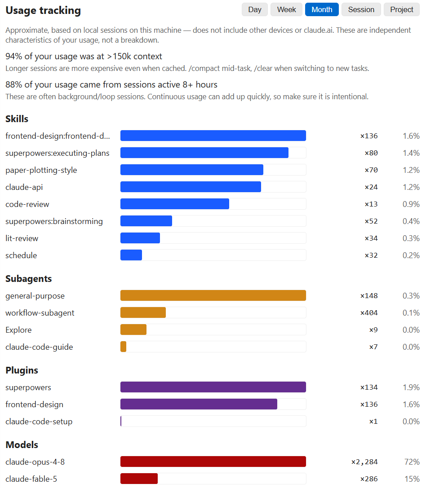

# Claude Code Usage

[](https://marketplace.visualstudio.com/items?itemName=growthjack.claude-code-usage)
[](https://marketplace.cursorapi.com/items/?itemName=GrowthJack.claude-code-usage)
[](https://opensource.org/licenses/MIT)

**The local Claude Code and Codex usage coach in your status bar.** Not a
billing tool. Claude keeps its cost and quota views; the v2.3 Codex Beta adds
provider-specific token and behaviour insights through the same dashboard tabs,
render functions, and visual system without pretending both providers expose
the same data.

> **What this is:** A VS Code status-bar monitor that reads your local
> Claude Code and Codex logs and shows provider-appropriate usage views — plus
> optional guidance that helps reduce avoidable token and workflow overhead.
>
> **What this is _not_:** a billing tool. Claude dollar amounts are estimates
> based on public per-million-token rates. Codex has no billing-cost card; its
> first summary card is an explicitly labelled API-equivalent cost estimate,
> and its weekly allowance panel uses the same proxy rather than billing data.
> Refer to the provider account for billing truth.

> **看清 Claude Code 与 Codex 的本地用量，让 AI 帮你用得更好。**
>
> **简介**：一个 VS Code 状态栏小工具。Claude 保留成本与配额视图；
> v2.3 的 Codex Beta 则按 Codex 自身的数据语义展示 token、effort、任务结构
> 和本地优化建议，同时复用 Claude 仪表盘的标签页、渲染函数和视觉体系，
> 而不是另做一套页面或强行套用 Claude 的统计口径。
>
> **它不是什么**：账单工具。Claude 金额为估算值；Codex 首张汇总卡仅显示
> 明确标注的 API 等效成本估算，每周额度面板也使用同一代理口径，而非账单数据。
> 实际费用请以相应供应商的官方账单为准。

🌐 **Multi-language documentation**:
[English](README-en.md) ·
[繁體中文](README-zh-TW.md) ·
[简体中文](README-zh-CN.md) ·
[日本語](README-ja.md) ·
[한국어](README-ko.md) ·
[Bahasa Indonesia](README-id.md)

---

## Screenshots

### v2.3 Claude, Codex and Compare

The four v2.3 images below are reproducible captures of the production dashboard
renderer with synthetic fixtures and VS Code Light+/Dark+ theme variables, not
personal usage or billing evidence. Native VSIX installation is verified separately.


*Today and Last 30 days share the configured calendar timezone. CLI usage is
counted only when normal persistent sessions leave usage-bearing local logs;
calls made without session persistence cannot be reconstructed.*


*The corrected Codex overview uses one configured-timezone calendar model for
Today, Last 30 days, months, models, effort, and all-time totals.*


*Observed quota windows retain reset evidence locally. A valid used fraction can
produce labelled total and unused subscription-durability estimates, including
for the current window. Approximate evidence remains visible with low confidence.
Period details start collapsed; expand them to inspect the numeric evidence.*


*Compare combines provider daily activity without double-counting Codex cached
input or reasoning. Its preview-first share studio offers an Academic Violet
default, curated/custom colors, deterministic local SVG, and privacy-safe
Markdown. It is enabled by default and can be hidden with the single sharing
workspace setting. Card settings sit below the preview; intensity can use quantile,
logarithmic, or linear scaling. The metric is activity volume, not productivity or billing.*

### Claude status bar

Codex uses a compact **Today token usage** item and a separate **remaining quota**
item: observed 36% weekly utilisation displays `wk 64%`. The hover card retains
utilisation progress bars, reset times, and wrapped explanations. Local Codex
quota is last-observed evidence, not a live account balance.


*Today's cost · current-session cost · 5-hour and weekly quota utilisation.*

Hover the quota indicator for a breakdown:


*Real `/usage` data: utilisation percent, plus time left and the wall-clock reset for every window.*
*Every weekly cap your plan meters gets its own row, per-model ones included (Anthropic supplies the name, so the row follows whichever model is capped), plus usage credits when you have them enabled.*

### Dashboard


*Click the status bar to open the full dashboard. Stacked token-composition
chart, hourly breakdown, cache hit rate, cost composition by token type,
plus per-model and per-day tables below.*

### Content tab — where your tokens actually go



*Estimated breakdown of which content consumes tokens — your prompts vs.
tool results (by tool) vs. assistant output / thinking. This is the lever
for optimising your usage. Scoped to the last 30 days
(`advice.promptWindowDays`).*

### AI advice — evidence first, sending optional

v2.3 keeps one readable path from a local observation to its
evidence, recommendation, action, feedback, and guarded result. It is off by
default. Local evidence appears before any model is involved; **Helpful**, **Not
helpful**, and **Applied** stay on this device. Once enough reliable, similar
before/after tasks exist, the card reports the frozen comparison result;
otherwise it says that the evidence is insufficient.

Each recommendation can be snoozed for a bounded period; it leaves the default
summary and returns after expiry or when you choose to show it again.

AI personalisation is a separate choice. Aggregate-only is the default and
prompt samples remain off until separately allowed. The extension prepares the
complete request once and shows its exact JSON, byte count, and SHA-256. Preview
sends nothing; **Send this exact request** is a second explicit action, using the
same canonical bytes and your own configured key/endpoint. Claude Code OAuth
credentials are never used as a generative backend.

A flavour of what it returns (illustrative):

> **Write more complete instructions**
> - Several prompts open with "fix the bug" but don't name the file or the
>   symptom, so the first turn is spent searching. Lead with the file + expected
>   vs. actual behaviour.
>
> **Cut waste where it doesn't cost clarity**
> - ~38% of your tokens are spent above 150k context. `/clear` between unrelated
>   tasks keeps each request cheaper.

### Usage Optimizer


Paste a rough, half-formed request; get back one clean, **paste-ready** prompt
(plain text, no Markdown) plus a recommended reasoning effort / thinking / model
shown as chips. Three optional toggles refine it (flag vague references · condense
long pastes · suggest a style direction). Experimental, off by default; **only the
text you paste is included** — never your files or the terminal. It now uses the
same full-request preview and separate explicit Send action as AI advice.

---

## What's new in 2.3

- **Refined throughout the v2.3 line** — GPT-6 Astra and Fable 5.1 model
  metadata, optional AWS Bedrock pricing, a fixed-reference display-currency
  selector, complete month/day/hour drill-downs, state-preserving refresh,
  accessible charts, and lower watcher/title-index overhead. Patch-level
  details stay in the changelog and GitHub Releases.
- **Codex Beta, enabled by default** — usage records are discovered only from
  `sessions/**/*.jsonl` and `archived_sessions/**/*.jsonl`; credential,
  database, and unknown files stay excluded. Separately, the extension streams
  exactly `$CODEX_HOME/session_index.jsonl` to map `id` to `thread_name` for
  truthful thread titles. Absolute paths are redacted and titles stay memory-only.
  Usage-record JSONL lines are streamed and temporarily parsed only to extract
  allowlisted usage and structural metadata; prompt, response, command, and
  tool-argument fields are not inspected or used for analysis, and are never
  retained or persisted.
  Disable Codex at any time in **Settings → Providers**.
- **Codex-native metrics** — **processed** = input + output; **uncached usage** =
  uncached input + output; **cached input** is a subset of input; **reasoning**
  is a subset of output. The overview also shows input cache hit rate as cached
  input / input. No Codex billing cost is shown. The first Codex summary card is
  a clearly labelled API-equivalent cost estimate for the selected scope; the
  All-time view also shows the weekly trend using the same pricing basis.
- **Calendar-day Today and cost trends** — Codex Today means the current day in
  your configured timezone and adds exact hourly API-equivalent cost beside a
  separate token-composition view. Daily and monthly primary charts default to
  API-equivalent cost while token composition stays separately visible. Only
  exact known-model prices contribute; unknown models remain unpriced and every
  row keeps pricing coverage visible. The schema-3-compatible hourly sidecar
  keeps sparse buckets for the rolling last 30 days, is checkpointed and
  resumable, evicts day 31, and serves date expansion with zero JSONL reads on
  click. Codex monthly charts and tables list months oldest-first.
- **Request-level token attribution** — valid `last_token_usage` components are
  preferred, while its `total_tokens` remains an active-context measurement,
  not request usage. A full numeric total-plus-last signature suppresses only
  proven replay; missing last snapshots fall back to cumulative lineage
  high-water. Upgrading triggers one automatic reindex, with the indexed
  subtotal still visible throughout the pass.
- **Weekly allowance-value trend** — Claude and Codex All-time / Compare views
  calculate historical used equivalents directly from local token logs. The
  newest valid official reset observation anchors one sequence of unique,
  non-overlapping weekly periods, and each usage event belongs to exactly one
  period; without a usable observation, usage-only rows fall back to
  Monday-to-Monday UTC calendar weeks. A genuinely different quota series with
  an overlapping, non-aligned future reset is a conflict; same-series observations
  remain one series and may be shown as a low-confidence approximation. It cannot
  create a second current period, and period ranges are shown separately from reset times. Codex usage is
  stored in daily slices: when one crosses an official intraday reset, its tokens
  are still counted once, the affected period is labelled a boundary
  approximation. Codex's account-wide `codex` observations can decorate both
  historical and current buckets. If an observed reset drifts from the seven-day
  grid, the sample is mapped to the display period containing its observation
  time; file-source uncertainty, reset drift, and daily boundary crossings lower
  confidence and are labelled as approximate. File keys are not account
  identities, so eligible local files in one home are included together. A
  current period still uses the latest real observation for a low-confidence
  blended estimate when local quota series overlap. Ambiguous completed periods,
  or periods without a usable observation, remain usage-only rather than
  inventing an account split. Any coherent
  observed window—including the current one—can show total and unused durability
  estimates; attribution or boundary uncertainty lowers confidence instead of
  silently replacing the values with dashes.
  This display rule neither changes the index schema nor triggers a rebuild.
  Current official API rates are applied consistently across history. This is a
  proxy, not a bill or an official subscription price. The panel is enabled by
  default and can be hidden in Settings with `showWeeklyEquivalentValue`.
- **One dashboard render stack** — switching to Codex keeps the established
  Today / Last 30 days / All time / Sessions / Projects / Content / Settings structure,
  relabelled where Codex semantics differ. The same render functions, HTML
  classes, charts, tables, spacing, and responsive rules are used for both
  providers. Claude and Codex time-series charts stay width-aligned while dense
  content scrolls within its own region; Codex recommendations use indexed
  30-day structural evidence.
- **Truthful names, no invented concepts** — root tasks use the latest real
  thread title after path redaction. Child rows prefer their own real thread
  title; when it is missing, they use the reported nickname and display the
  parent/root title; if those are also missing, they receive a localized neutral
  fallback. Projects use the Git repository name or, outside Git, the directory
  basename. The Codex view does not manufacture Branches or Workflows that
  cannot be measured reliably.
- **Claude / Codex / Compare modes** — keep each provider's meaning intact.
  Compare shows input, output, and cache side by side; it never adds unrelated
  costs or quota windows together.
- **Auditable time and coverage** — rolling 7-day and 30-day totals use exact
  event-day slices in your configured timezone. During an incomplete migration
  or rebuild, every Codex card, table, project, session, recommendation, and
  status value is visibly an **indexed subtotal**; unverified legacy totals are
  excluded. Once a Codex home is detected, its provider tab appears immediately;
  the page shows exact indexed-file, percentage, and byte progress during the
  first build, while Compare waits until both providers have real data. After
  the first atomic checkpoint, the complete subtotal dashboard stays usable
  while indexing continues; progress never replaces its cards or tables. A selected Codex home is account-agnostic,
  so logs left by multiple
  sign-ins in that same home are combined. Local logs expose no reliable account
  identity, so limit cards remain **last-observed** and are never summed.
- **Private, scalable local index** — stores machine-salted pseudonymous keys;
  numeric and structural aggregates; and sanitized project, directory, agent,
  model, effort, role, time, and quality metadata. It never persists raw IDs,
  full paths or repository URLs, thread titles, or conversation bodies. A
  background worker scans large histories with a default 30-second watcher delay
  (Off / 10 / 30 / 60 / 120 / 300 seconds).
  A first-time index or incomplete legacy migration gets one bounded 64 GiB /
  16,384-file-pass streaming ceiling; it does not reserve that amount of memory
  and remains cancellable and resumable. After convergence, background work
  returns to 128 MiB / 64 file passes and the always-visible Refresh action uses
  2 GiB / 512 file passes. Unchanged warm refreshes still read zero usage-record
  JSONL body bytes.
- **Provider-aware controls** — the shared Settings tab shows only common and
  Codex-effective controls when Codex is selected. Codex collection and local
  Codex recommendations can each be disabled.
- **Exact-version release notice** — the upgrade message only describes the
  installed release. It is on by default and can be disabled in Settings.

## What's new in 2.2

- **Usage share card** (opt-in, `enableShareCard`) — a themed, configurable
  one-page SVG of your usage: pick a range × scope (overall / project / session)
  × which metrics to show, and a theme (**Claude Classic** / **Cream** /
  **Aurora Dark** / **Auto**), with an optional GitHub avatar + name.
  Self-contained and deterministic; no prompts, paths or ids ever leave your
  machine. Chinese locales use 万/亿 units.
- **Read-only conversation viewer** (Sessions tab, **on by default**) — a "view"
  button re-opens a past session's prompts and Markdown-rendered answers so you
  can jog your memory **without** loading it back into the model's context
  (unlike resume). Thinking and tool traffic sit behind toggles; opens on the
  last rounds.
- **Token heatmap** (opt-in, `showHeatmap`) — a GitHub-style yearly token heatmap
  on the All tab, plus **Export / Publish to your GitHub profile** as a
  self-contained SVG with a one-click Markdown embed.
- **Experimental insights** (opt-in, `showInsights`, Content tab) — labelled
  estimates from your local logs: a **cache-churn bill** ($ spent re-writing
  cache after model switches / idle gaps), **cache warmth by model**, **big
  one-shot turns**, **your active hours**, and **skill ROI** (output tokens
  returned per $).
- **Top-10 costliest messages** (opt-in, `showCostliestMessages`) — ranks single
  turns by cost, splitting a **cache miss** from a long answer, with the
  cache-hit rate and the time since the last turn.
- **Sessions "Active" column** — estimated hands-on time per session (idle gaps
  capped at 1.5 h), far more meaningful than the raw first-to-last span.
- **Cache-hit-rate column** in the All-time (monthly) and This-month (daily)
  tables and their drill-downs, so cache efficiency is visible per row.
- **Live-refresh delay** (`fileWatchSeconds`: Off / 1 / 2 / 5 / 10 / 20 / 30 s)
  replaces the on/off live-watch toggle; it only re-reads your **local** logs.
- **Timezone-aware bucketing** — Today / day / month / hour totals all key off
  your configured IANA zone (full UTC-offset dropdown), so they agree with each
  other and the Anthropic console.
- **"What's new" prompt after upgrades** — a single dismissible nudge the first
  time you run a new major.minor version, so opt-in features stay discoverable.
- **Fixes** — Sonnet 5 reports a 1M context window (#50); 1-hour cache writes are
  priced at 2× base input when the log carries the split (#62); background
  windows refresh on focus instead of going stale (#55); the Timezone setting is
  a validated dropdown so a bad value can't crash the dashboard (#51); German
  (de-DE) and Brazilian Portuguese (pt-BR) are selectable everywhere.

## What's new in 2.1

- **Sessions: resume / copy / delete** — each row can copy the session id,
  **resume** it (official Claude Code extension in-tab for this project, or a
  terminal `claude --resume <id>` for other projects), or **delete** it (to the
  trash, with confirm). A **Current project / All** filter defaults to the
  current project.
- **Quota display options** — `quotaFiveHourOnly` (show only the 5h
  window) and `showResetInStatusBar` (append the reset countdown, e.g.
  `5h:50%:2.3h | wk:30%:3.2d`), both in ⚙ Settings.
- **Wider dashboard** — detail page widened to 1600 px, still fluid
  on narrow screens.
- **Workflows tab** — every multi-agent run in one place: dynamic-workflow
  runs (ultracode) *and* ad-hoc sub-agent batches, with per-run cost, agent
  count, models used, **cache hit rate** (the "is my provider workflow-ready"
  diagnostic) and a per-agent drill-down labelled by each agent's task.
- **Usage tracking panel** — the official `/usage` "what's contributing"
  view, but multi-provider and with five scopes (Day / Week / Month /
  session / project): >150k-context share, 8h+-session share,
  subagent-heavy share, workflow share, plus Skills / Subagents / Plugins /
  Models breakdowns. Compact card on the Today tab.
- **Thinking share** per session (Sessions column + Today card) with an
  `/effort` hint when it runs high.
- **Workflow quota guard** — a dismissible banner before you start a run
  the remaining 5-hour window can't finish
  (`claudeCodeUsage.workflowQuotaWarnPercent`).
- **Settings in the dashboard** — a new ⚙ Settings tab manages every option
  in place; VS Code's own Settings keeps only the three that benefit from
  syncing (`language`, `dataDirectory`, `advice.apiKey`). Header buttons
  trimmed to ✨ AI advice and ⚙ Settings (both jump to their tab); the
  auto-refresh toggle moved into Settings (a manual ↻ appears when paused).
  If you hide the cost, quota *and* context items, the status bar keeps a small
  icon as a way back into the dashboard.
- **Status-bar metric** (`statusBarMetric`) — keep showing today's cost, or
  switch the first item to today's total **token** count (compact k/M).
- **Model-scoped weekly limit** (`showScopedWeekly`, opt-in) — adds the weekly
  cap actually named by Anthropic, such as `fable 17%`; migrated from the
  original model-specific contribution in PR #38 by
  [@wheelbarrel00](https://github.com/wheelbarrel00).
- **AI advice 2.0** — bring your own key for Anthropic or an OpenAI-compatible
  endpoint (`advice.apiFormat`). The v2.3 line places local evidence and an exact full-
  request preview before the separate Send action. Aggregate-only is the
  default; prompt samples and `advice.userContext` require independent prompt-
  personalisation consent and appear verbatim in the preview. The keyless
  Claude Code subscription backend is not shipped and is unreachable.
- **Usage Optimizer** (experimental, `advice.optimizer.enabled`, default off) —
  a Content-tab card where you paste a rough request and get back one tightened
  prompt as **plain text** (paste-ready, no Markdown) plus a recommended effort
  / thinking / model. Three optional lenses (flag ambiguous references ·
  condense long pastes · suggest a style direction). **Only the text you paste
  is included**, and the full provider request must be previewed and explicitly
  sent.
- **Context-window indicator** (experimental, off by default) — opt in via
  Settings to show the current session's context fill in the status bar. A "~"
  marks a guessed window; set `contextWindowOverride` for proxied/custom models.

## What's new in 2.0

- **Real 5-hour and weekly quota** in the status bar — reads the OAuth session
  from the same Claude profile as the window: explicit `dataDirectory`, then
  the first valid `CLAUDE_CONFIG_DIR`, then `~/.claude`. The macOS Keychain is
  used only for the default profile.
  Adapted from upstream [PR #9](https://github.com/ClaudeCodeUsage/ClaudeCodeUsage/pull/9)
  by [@Dobidop](https://github.com/Dobidop).
- **Four new tabs**: Sessions, Projects, Content, Branches — all sortable.
- **Token-composition stacked chart** with Y-axis and reference lines.
- **AI advice command** — now routes to the unified local-evidence surface; a
  missing API key leaves the request unsent instead of opening a separate demo
  or transport path.
- **Multi-vendor pricing**: Opus 4.x, Sonnet 4.x, Haiku 4.5 (verified
  against Anthropic's public pricing); reference rates for proxied setups
  (OpenAI, Gemini, DeepSeek, Kimi, GLM, Qwen) with family-aware fallback.
  `Refresh Token Pricing` pulls live LiteLLM data as runtime overrides.
- **Custom timezone** for date display (`claudeCodeUsage.timezone`).
- **Light-theme tab readability** fixed.
- **Locale-aware numbers and dates** throughout (German `.`, English `,`).
- **Real-time status bar** via `fs.watch` (1.5 s debounce) + idle-aware
  refresh + non-blocking loader (yields every 25 files).

Full changelog: [CHANGELOG.md](CHANGELOG.md).
Closes upstream issues
[#7](https://github.com/ClaudeCodeUsage/ClaudeCodeUsage/issues/7),
[#10](https://github.com/ClaudeCodeUsage/ClaudeCodeUsage/issues/10),
[#11](https://github.com/ClaudeCodeUsage/ClaudeCodeUsage/issues/11),
[#13](https://github.com/ClaudeCodeUsage/ClaudeCodeUsage/issues/13).

---

## Install

### VS Code Marketplace

Search for **`Claude Code Usage`** in the Extensions view (`Ctrl+Shift+X`),
or:

```
ext install GrowthJack.claude-code-usage
```

### Cursor / Windsurf / Antigravity (Open VSX)

Same extension is published at the Open VSX Registry:
[GrowthJack.claude-code-usage](https://marketplace.cursorapi.com/items/?itemName=GrowthJack.claude-code-usage).

### From a `.vsix` file

`Ctrl+Shift+P` → **Extensions: Install from VSIX...** → pick the
downloaded `.vsix`.

---

## Configuration

**Most settings live in the dashboard now.** Open the dashboard (run
**Show Usage Details**, or click the ⚙ in its header) and use the **⚙ Settings**
tab — grouped into General, Status bar, Data & refresh, and AI advice &
Optimizer. Changes apply immediately.

To keep VS Code's own Settings UI uncluttered, only four settings stay there
(so they still travel with Settings Sync). Open Settings (`Ctrl+,`) and search
for **`Claude Code Usage`**:

| Setting | Default | What it does |
|---|---|---|
| `language` | `"auto"` | UI language: `auto` / `en` / `de-DE` / `zh-TW` / `zh-CN` / `ja` / `ko` / `pt-BR` / `id`. |
| `dataDirectory` | `""` | Custom Claude data dir; empty = auto-detect. |
| `codex.dataDirectory` | `""` | Custom Codex home; empty = `CODEX_HOME` or `~/.codex`. |
| `advice.apiKey` | `""` | Bring-your-own key for AI advice + the Usage Optimizer; empty means no request can be sent. |

Everything else — refresh interval, status-bar items, number/date formatting,
project grouping, content analysis, and all the AI advice / Optimizer options —
is in the dashboard's ⚙ Settings tab. Upgrading keeps your existing values: a
one-time migration copies them out of `settings.json` on first launch.

---

## How costs are calculated

The status-bar cost is **`Σ (tokens × per-million rate)`** across input,
output, cache-write and cache-read, summed by model.

- **Per-million rates** come from the bundled pricing table, which is
  verified against the public Anthropic pricing page and supplemented
  with reference rates for non-Anthropic models that may appear in
  proxied setups.
- **`Refresh Model Pricing`** (command + button in the dashboard) pulls
  live prices from [LiteLLM's public dataset](https://github.com/BerriAI/litellm)
  as runtime overrides.
- **Unknown model snapshots** are priced against the current tier of
  their detected family (Opus / Sonnet / Haiku / GPT / Gemini /
  DeepSeek / Kimi / GLM / Qwen) instead of falling back blindly.

Claude transcript totals are counted by **response identity**, not by JSONL
row. One response can produce both a `thinking` row and a `text` row carrying
the same `messageId`, `requestId`, and complete `usage` vector. The extension
keeps the largest vector for that response once; Claude Code's `stats-cache`
adds the rows. The two totals can therefore differ.

What the status bar does **not** know:
- Your actual Anthropic invoice (discounts, free credits, plan caps).
- Whether your proxy provider charges different rates.
- Anything not recorded in your local `.jsonl` log files.

The **5h / weekly quota indicator** is different — it queries Claude
Code's real `/usage` endpoint via the OAuth session and shows the actual
percentage Anthropic is tracking for your account. That number is
authoritative.

---

## Privacy

The complete user-facing inventory, retention rules, clearing behavior, and
remote boundaries are in [Local data and privacy](LOCAL-DATA.md) ([简体中文](LOCAL-DATA.zh-CN.md)).

| Data | Stored locally | Remote behavior | Clear path |
|---|---|---|---|
| Claude/Codex source logs | Provider-owned and read-only; never copied wholesale | None by default | Managed by the provider tools, not deleted by this extension |
| Codex derived index | Bounded pseudonymous numeric/structural aggregates | None | Rebuild or clear derived index |
| Quota observations | Bounded anonymous window facts; no raw account ID | Claude quota fetch only when enabled; Codex evidence stays local | Clear by provider/account epoch or all |
| UI/share preferences | Tab/filter state plus optional title/range and GitHub destination strings | Publish only after exact explicit confirmation | Reset UI or sharing preferences independently |
| Advice data/key | Bounded aggregate evidence; key only in SecretStorage | Exact previewed request only after separate Send | Clear advice data and key independently |

- All **Claude** token / cost / session analysis runs locally by reading your
  `~/.claude/projects/**/*.jsonl` files.
- Codex usage records are discovered only from `sessions/**/*.jsonl` and
  `archived_sessions/**/*.jsonl` below your Codex home. Separately, the extension
  streams exactly `$CODEX_HOME/session_index.jsonl` for the `id` → `thread_name`
  mapping used by truthful thread titles. Absolute paths in those titles are
  redacted and the titles remain memory-only. Credentials, databases, and unknown
  files are not read. Usage-record JSONL lines are streamed and temporarily
  parsed only for allowlisted metadata; prompt, response, command, and
  tool-argument fields are not inspected or used for analysis and are never
  retained. Deterministic insights make no network request.
- The Codex persistent index stores machine-salted pseudonymous keys, numeric
  and structural aggregates, and sanitized project, directory, agent, model,
  effort, role, time, and quality metadata. It never stores raw IDs, full paths
  or repository URLs, thread titles, or conversation bodies.
- The quota indicator calls **`api.anthropic.com/api/oauth/usage`** using
  Claude Code's existing OAuth token. No additional credentials are sent.
- **AI advice** and the **Usage Optimizer** are the only features that call a
  model — and only after *you* preview and explicitly send a prepared request.
  Advice defaults to allowlisted aggregates; prompt samples and optional user
  context require separate consent. The Optimizer includes **only the text you
  paste into it** (never your files or terminal). Both use the exact previewed
  bytes, the endpoint in `advice.apiUrl`, and your own `advice.apiKey`.
  **Bring your own key**; no key or generative OAuth credential is shipped.

### Known limits

- A reset absent from an official response or local structured event cannot be
  reconstructed; day-only evidence lowers confidence.
- One Codex home may contain several sign-ins. The current period may therefore
  show a low-confidence blended estimate from the latest real observation;
  ambiguous completed periods remain used-only rather than inventing an account split.
- API-equivalent values depend on current known API prices and visible pricing
  coverage. They are not bills or subscription prices.
- Source-log retention belongs to Claude Code and Codex. Uninstall may leave
  host-managed extension storage behind, so the explicit clear controls are the
  reliable deletion route.

---

## Troubleshooting

**"No Claude Code Data"**
- Make sure Claude Code is installed and you have used it at least once.
- Check the `dataDirectory` setting; auto-detection looks at
  `~/.claude/projects` and `~/.config/claude/projects`.

**One-shot Claude CLI activity is missing**
- Calls made with `--no-session-persistence` can leave a prompt-history entry
  but no project transcript and no token `usage` fields. The extension does not
  invent token or cost totals from prompt history. Run future audited calls
  without that flag if they should appear; past unpersisted token usage cannot
  be reconstructed locally.

**Quota row shows `5h:--% wk:--%`**
- Claude Code's OAuth token is missing or expired. Log in to the active Claude
  profile once. Credentials follow explicit `dataDirectory`, then the first
  valid `CLAUDE_CONFIG_DIR`, then `~/.claude`; the single global macOS Keychain
  item is never substituted for a selected custom profile.

**`Get AI Usage Advice` returns 404**
- DeepSeek's current endpoint does **not** use a `/v1` prefix. Use
  `https://api.deepseek.com/chat/completions`. The extension auto-strips
  `/v1` if present.

**`Send this exact request` is unavailable**
- Enable the default-off advice-effectiveness setting, allow aggregate data,
  and configure your own `claudeCodeUsage.advice.apiKey`. Previewing is always
  local; without a key the request remains unsent.

**High CPU or sluggish refresh on a large history (Linux included)**
- V2.2.1 removes the hidden 8-second active polling override and bounds the
  first-timestamp scan. Until you install it, set **Live refresh delay** to
  **Off**, set **Refresh interval** to **300–900 seconds**, and optionally turn
  **Content analysis** off. Turning Dashboard auto-refresh off by itself does
  not stop status-bar parsing.
- If V2.2.1 still runs hot, open **Show Diagnostic Logs** and attach only the
  anonymous `refresh:` lines to issue #70; they contain counts and timings, not
  prompts, paths, session IDs, credentials, or raw log lines.

**Usage history disappears or is missing older months**
- Claude Code automatically deletes conversation logs older than
  `cleanupPeriodDays` (default: **30 days**). Once deleted, those records
  cannot be recovered. To retain more history, add this to your
  `~/.claude/settings.json`:
  ```json
  { "cleanupPeriodDays": 365 }
  ```
  This only affects logs kept from now on; already-deleted logs cannot be
  restored. Thanks to [@nickearnshaw](https://github.com/nickearnshaw) for
  documenting this ([PR #21](https://github.com/ClaudeCodeUsage/ClaudeCodeUsage/pull/21)).

**Token counts are lower than Claude Code's `stats-cache`**
- A single response can be written as separate `thinking` and `text` transcript
  rows with the same `messageId`, `requestId`, and complete `usage` vector. The
  extension counts that response identity once and keeps its largest vector;
  Claude Code's `stats-cache` sums the rows. The extension does not apply a
  multiplier to make these different mechanisms agree.

**Token counts appear lower than the model provider's own dashboard**
- If you use Claude Code with a third-party proxy that routes requests
  through sub-agents or background workflows (e.g. ultracode / dynamic
  workflows), each agent writes its own `.jsonl` log file inside a
  sub-directory. The extension reads all these files, but some proxy
  configurations may not write agent-level records at all. Until native
  workflow attribution is added in a future release, the total shown here
  may be lower than the provider's upstream count. Your actual spend is
  always on your provider's billing page.

---

## Credits

Maintained by [**@Carl723000**](https://github.com/Carl723000), who forked it
from [@jack21](https://github.com/jack21)'s original
[`ClaudeCodeUsage`](https://github.com/jack21) and now also helps own and
maintain the upstream organization
[`ClaudeCodeUsage/ClaudeCodeUsage`](https://github.com/ClaudeCodeUsage/ClaudeCodeUsage).
MIT-licensed. The 2.x work documented here (everything under "What's new") is by
@Carl723000 with [Claude Code](https://claude.com/claude-code); it has grown well
beyond the 2.0 baseline — see [CHANGELOG.md](CHANGELOG.md).

Development-tool credit: repository maintenance uses both
[Claude Code](https://claude.com/claude-code) and
[OpenAI Codex](https://developers.openai.com/codex/). This credits the tools
separately from human contributors: Codex is not added to Release Drafter's
contributor list, and no fabricated `Co-Authored-By` identity is used for it.

Contributors whose upstream PRs / issues are incorporated here:

- [@Dobidop](https://github.com/Dobidop) —
  [PR #9](https://github.com/ClaudeCodeUsage/ClaudeCodeUsage/pull/9), the OAuth
  approach for reading real `/usage` data; the quota indicator is adapted from
  that work.
- [@nickearnshaw](https://github.com/nickearnshaw) —
  [PR #8](https://github.com/ClaudeCodeUsage/ClaudeCodeUsage/pull/8) locale-aware
  number/date formatting;
  [PR #20](https://github.com/ClaudeCodeUsage/ClaudeCodeUsage/pull/20) fix for
  the webview/status-bar getting stuck on "Loading…" (re-entrancy guard +
  spinner only on cold start);
  [PR #21](https://github.com/ClaudeCodeUsage/ClaudeCodeUsage/pull/21) docs on
  `cleanupPeriodDays` for retaining usage history;
  [PR #24](https://github.com/ClaudeCodeUsage/ClaudeCodeUsage/pull/24) quota-window
  rollover handling (drop a window once its reset has passed).
- [@ScherbakovAl](https://github.com/ScherbakovAl) —
  [PR #31](https://github.com/ClaudeCodeUsage/ClaudeCodeUsage/pull/31), the
  original status-bar context-window indicator and the `showCost` toggle.
- [@wheelbarrel00](https://github.com/wheelbarrel00) —
  [PR #38](https://github.com/ClaudeCodeUsage/ClaudeCodeUsage/pull/38), the opt-in
  weekly Opus limit in the status bar, which grew into today's API-named
  `showScopedWeekly`.
- [@brenoneill](https://github.com/brenoneill) —
  [PR #14](https://github.com/ClaudeCodeUsage/ClaudeCodeUsage/pull/14), custom
  data directory (merged into upstream 1.0.8).
- [@mxzinke](https://github.com/mxzinke) — Opus 4.5 / Haiku 4.5 prices
  + German translation (upstream 1.0.8).

Also closed along the way: the test-suite seed
([#25](https://github.com/ClaudeCodeUsage/ClaudeCodeUsage/issues/25)) and
unreliable context-window detection for proxied/custom models
([#31](https://github.com/ClaudeCodeUsage/ClaudeCodeUsage/issues/31)).

Many code changes in this fork were drafted with assistance from
[Claude Code](https://claude.com/claude-code) (commits include
`Co-Authored-By: Claude <noreply@anthropic.com>`).

---

## Changelog

The current changelog lives in [**CHANGELOG.md**](CHANGELOG.md). The
most recent 2.1 entry summarises every feature, fix and personalisation
option in this release.

<details>
<summary><b>Pre-2.0 history (upstream 1.0.x)</b></summary>

### v1.0.8 (2025-11-28)
- Converted code comments from Traditional Chinese to English.
- Improved internationalisation standards.
- Pricing: added Opus 4.5 / Haiku 4.5 (thanks @mxzinke).
- Added German (de-DE) translation (thanks @mxzinke).

### v1.0.7 (2025-11-28)
- Multilingual translation for hourly usage labels.
- Removed hardcoded Chinese text; switched to i18n.

### v1.0.6 (2025-08-10)
- Added support for Claude Opus 4.1 pricing.

### v1.0.5 (2025-01)
- Hourly usage statistics + visualisation.

### v1.0.4 (2025-01)
- All-time data calculation; "All Time" translations.

### v1.0.3 (2025-01)
- Repository URL migration + README image link fixes.

### v1.0.0 (2025-01)
- Initial complete release.

</details>

---

## Contributing

Issues and pull requests are welcome on the
[GitHub repository](https://github.com/ClaudeCodeUsage/ClaudeCodeUsage).

## License

[MIT](LICENSE)
